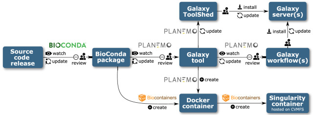

# NOTES

## Best Practices

high-level schema of cluster
https://github.com/orgs/galaxyproject/projects/28/views/1?pane=issue&itemId=25534709

separate config data and code
run non-priviledge
run DB on another server

in ansible.cfg

```ini
[ssh_connection]
pipelining = true
```

check out new_user_dataset_access_role_default_private
https://training.galaxyproject.org/training-material/topics/admin/tutorials/users-groups-quotas/slides.html#10
but requires extra step when adding data libraries with ephemeris to change permissions

playbooks are online
https://github.com/galaxyproject/usegalaxy-playbook
https://github.com/galaxyproject/infrastructure-playbook

use tpv to restrict access to interactive tools, can be used by miners

## Database

in hosts

```ini
[dbservers]
hostname
```

instead of dbservers:children

To use postgres via another machine, or via the network, you can add lines like the following:

postgresql_pg_hba_conf:

- host all all 127.0.0.1/32 md5
  Here you should either add multiple lines per IP address that needs access to the Postgres server (with netmask /32), or a less specific IP range defined also via netmask.

Additionally you’ll need to change the postgresql_objects_users statement to include a password (maybe stored in a vault, discussed later!)

postgresql_objects_users:

- name: galaxy
  password: super-secret-password-that-should-be-in-vault

adjust
postgresql_backup_local_dir: "{{ '~postgres' | expanduser }}/backups"
if db not on same machine as galaxy server(will be expanded on galaxy, but run on db ?)

## cleanup

### user

for datasets

scripts/cleanup_datasets/pgcleanup.py

wrapper around pgcleanup
gxadmin cleanup <days>

for tmp (aborted uploads)

/usr/bin/tmpwatch -v --mtime --dirmtime 7d /srv/galaxy/var/tmp

## upload

managed by a different tusk server

## NGINX

dont use staging for ssl in prod

## Logs

journalctl
galaxyctl follow
/tmp/gxadmin

scontrol show job ID
only there for 5 min, slurm can have db to keep it

show users ressource usage:
expose_potentially_sensitive_job_metrics: true

gunicorn/gravity logs
handler logs (if not all-in-one)
Pulsar logs
nginx error and access logs
syslog/messages
authlog
browser console log

## jobs

job_conf.sample.yml for where to send jobs

## Data quota

250 gig
delete old untouched history(send email), usegalaxy australia
(usegalaxy.org has 4 pb of data)

## jobs cleanup

can be automated or keep errors (clean after a set time, need to setup)

## Update

check at bottom of release notes for the "full release notes" for admins
change galaxy_commit_id in group_vars/galaxyserver.yml

## cluster

https://training.galaxyproject.org/training-material/topics/admin/tutorials/ansible-galaxy/tutorial.html#running-on-a-cluster
put these folders on a shared filesystem:

galaxy_shed_tools_dir
galaxy_tool_dependency_dir
galaxy_file_path
galaxy_job_working_directory
galaxy_server_dir
galaxy_venv_dir

## TO RUN

ansible-galaxy install -p roles -r requirements.yml
ansible-playbook galaxy.yml

## Backup

galaxy

- the galaxy-managed config files
- the playbooks

the database
the data
/var folder

localion:
/data/backups/

warning: potentially unrevolvable conda environments
might need to backup/use singularity for reproducibility

### restore

https://training.galaxyproject.org/training-material/topics/admin/tutorials/backup-cleanup/tutorial.html#restoring-the-database

## welcome page

can just put iframe to proper wedsite (github.io ?)

## CVMFS

host a mirror or use from penn state ?
ask about how to host stratum 1 if its the route we choose
contains genomes refs but also singularity images for tools
cache size, set based on disk size(get size from ansible), ex: 60% .org

Question: If I use a cluster, will I need to configure this FS in each node (given that the folder is at / directly)?
Yes. Often admins with a cluster keep a smaller cache local to each compute node, and then setup a Squid proxy to hold the most commonly accessed data on a machine with more storage. E.g. each compute node could have 10-50GB of CVMFS storage while you might setup a Squid proxy with 200-300 GB of storage that will store everything your site uses.

Are you having issues mounting your CVMFS mount? Is it giving strange errors like “Endpoint not connected” Try running this command as root:
/usr/bin/cvmfs2 -d -o rw,system_mount,fsname=cvmfs2,allow_other,grab_mountpoint singularity.galaxyproject.org /mnt

## Tools

use ephemeris for installs



mulled tool can make container from any conda package, if part of bioconda it is auto-containerised and put on cvmfs
install with ephemeris
TODO: pull request for proper help display

Tip: Can I install tools without restarting?
Yes. The default tool config (config/tool_conf.xml.sample, copy to config/tool_conf.xml to modify) has an option, monitor="true" set in the root <toolbox> tag. This instructs Galaxy to watch the tool files referenced in that config and load or reload them as necessary. It will also add any tools you have added.

maintain a repo of yaml files with every tool:
https://github.com/usegalaxy-au/usegalaxy-au-tools/tree/master/usegalaxy.org.au
test all tools, uninstall broken ones

## Data libraries

fix permissions
set-library-permissions -g https://galaxy.example.com -a $API_KEY LIBRARY --roles ROLES role1,role2,role3

-- legacy:
This enables the use of legacy APIs even for newer Galaxies that should have a batch upload API enabled. Unfortunately the new batch upload API is not able to update existing data libraries in place and will always create new libraries with the same name. So currently --legacy is quite useful for maintaining a YAML file, and running setup-data-libraries regularly whenever that file has updates.
But this comes with the downside that the entire URL is used for the filename.

## Data sharing

expose_user_name
expose_user_email
allow user to search for users instead of inputing email without validation when sharing

## Quota

personal quota = user quota + group quota
group quota is not shared, so it is group members \* quota total space on disk

https://github.com/usegalaxy-eu/quota-sync (maybe cleanup ?)
for syncing ?

## Login

anything OICD

## Slurm

make sure /etc/munge/munge.key is the same on all slurm nodes
sinfo -Nel

use cgroup

## Pulsar

after playbook on pulsar server:
suod systemctl restart pulsar
sudo galaxyctl restart

## Celery

allows you to distribute galaxy server local tasks to reduce load on main server

## InfluxDB

set retention time to 2 weeks, need ~80G for .eu

## TIaaS

privoritise in tpv, give priority in slurm or reserve node/cluster

## Sentry

based on docker compose, can use that instead of ansible

## Debug

check sentry first

### Startup

gravity/gunicorn logs
job handler logs

#### Database migration

shouldn't happen with ansible
the 2 values should be the same:
lib/galaxy/model/migrations/alembic/versions_gxy/
`SELECT version FROM alembic_version;` in db

clean pyc files in migrate versions folder (ansible does this)

#### restart loop

check logs just before last startup

check gunicorn `journalctl -eu galaxy-gunicorn`

system might be killing it `/var/log/{messages,syslog,kern.log}, dmesg`

#### Web/ui

logs: gunicorn, nginx, browser console

###### 502

systemctl status galaxy-gunicorn: `[<PID>] [ERROR] Connection in use: ('localhost', 8080)`
check galaxy is running
check proxy `/var/log/nginx`
check if listening `sudo ss -tlpn 'sport = :port'` or `sudo lsof -i :port`

###### 504 gateway timeout

`htop -u galaxy` or `ps uwwW galaxy`
check if STATE(S or STAT) is `D`(bad)
check filesystem/disks
restart galaxy

###### slow ui/504

check load:
`uptime` average < nb cores (lscpu)
`htop`

check grafana load average

check load on web and database, check RAM/SWAP, check iowait

###### slow ui

py-spy

###### blank page/ no css/javascript

check for 404
check proxy error log for permission errors
verify proxy static config
rebuild client if recently modified gui/galaxy

###### Tools not installed

tool not in left panel: check startup logs in galaxy for tool errors
look for:
`Loaded tool id: toolshed.g2.bx.psu.edu/repos/iuc/sickle/sickle/1.33, version: 1.33 into tool panel....`
check `integrated_tool_panel.xml` or `shed_tol_conf.xml` if there is an entry for it

###### tools failure

cleanup_job: onsuccess
will keep the working dir if tool failed, make sure to cleanup

working dir is `/srv/galaxy/jobs/<hash>/<job_id>`
run it yourself with `srun --pty bash`

tool writes to stderr even on success:

add `<tool profile="16.04">` or later to ignore stderr but tool needs to use proper exit code

no such file or directory:

make sure /input/<filename> exists
check nfs mount and rerun
check nfs cahcning errors

command not found:
verfiy that tool_dependency_dir is accessible as the user running the job
check if dependencies are installed
use BioContainers

gateway timeout:
nginx timout, need to change proxy_read_timeout setting (default 60 sec) (some galaxies use 6-10 mins)

###### tool not running

gray means `job.state = 'new' or 'queued'` in db

successful logs:
p = PID

```
galaxy.tools INFO 2023-04-20 13:51:20,736 [pN:main.1,p:273250,tN:WSGI_0] Validated and populated state for tool request (4.308 ms)
galaxy.tools.actions INFO 2023-04-20 13:51:20,747 [pN:main.1,p:273250,tN:WSGI_0] Handled output named out_file1 for tool secure_hash_message_digest (0.756 ms)
galaxy.tools.actions INFO 2023-04-20 13:51:20,759 [pN:main.1,p:273250,tN:WSGI_0] Added output datasets to history (12.102 ms)
galaxy.tools.actions INFO 2023-04-20 13:51:20,761 [pN:main.1,p:273250,tN:WSGI_0] Setup for job Job[unflushed,tool_id=secure_hash_message_digest] complete, ready to be enqueued (1.097 ms)
galaxy.tools.execute DEBUG 2023-04-20 13:51:20,761 [pN:main.1,p:273250,tN:WSGI_0] Tool secure_hash_message_digest created job None (21.968 ms)
galaxy.web_stack.handlers INFO 2023-04-20 13:51:20,792 [pN:main.1,p:273250,tN:WSGI_0] (Job[id=2,tool_id=secure_hash_message_digest]) Handler '_default_' assigned using 'db-skip-locked' assignment method
galaxy.tools.execute DEBUG 2023-04-20 13:51:20,797 [pN:main.1,p:273250,tN:WSGI_0] Created 1 job(s) for tool secure_hash_message_digest request (60.168 ms)
galaxy.jobs.handler DEBUG 2023-04-20 13:51:20,879 [pN:handler_1,p:272701,tN:JobHandlerQueue.monitor_thread] Grabbed Job(s): 2
tpv.rules.gateway INFO 2023-04-20 13:51:20,920 [pN:handler_1,p:272701,tN:JobHandlerQueue.monitor_thread] loading tpv rules from: ['https://raw.githubusercontent.com/galaxyproject/tpv-shared-database/main/tools.yml', '/srv/galaxy/config/TPV_DO_NOT_TOUCH/tpv_rules_local.yml']
tpv.rules.gateway INFO 2023-04-20 13:51:21,266 [pN:handler_1,p:272701,tN:JobHandlerQueue.monitor_thread] Watching for changes in file: /srv/galaxy/config/TPV_DO_NOT_TOUCH/tpv_rules_local.yml
galaxy.util.watcher DEBUG 2023-04-20 13:51:21,266 [pN:handler_1,p:272701,tN:JobHandlerQueue.monitor_thread] Watching for changes to file: /srv/galaxy/config/TPV_DO_NOT_TOUCH/tpv_rules_local.yml
tpv.core.entities DEBUG 2023-04-20 13:51:21,354 [pN:handler_1,p:272701,tN:JobHandlerQueue.monitor_thread] Ranking destinations: [runner=local_runner, ... (line truncated)
galaxy.jobs.mapper DEBUG 2023-04-20 13:51:21,354 [pN:handler_1,p:272701,tN:JobHandlerQueue.monitor_thread] (2) Mapped job to destination id: local_env
galaxy.jobs.handler DEBUG 2023-04-20 13:51:21,370 [pN:handler_1,p:272701,tN:JobHandlerQueue.monitor_thread] (2) Dispatching to local_runner runner
galaxy.jobs DEBUG 2023-04-20 13:51:21,387 [pN:handler_1,p:272701,tN:JobHandlerQueue.monitor_thread] (2) Persisting job destination (destination id: local_env)
galaxy.jobs DEBUG 2023-04-20 13:51:21,402 [pN:handler_1,p:272701,tN:JobHandlerQueue.monitor_thread] (2) Working directory for job is: /data/jobs/000/2
galaxy.jobs.runners DEBUG 2023-04-20 13:51:21,412 [pN:handler_1,p:272701,tN:JobHandlerQueue.monitor_thread] Job [2] queued (41.730 ms)
galaxy.jobs.handler INFO 2023-04-20 13:51:21,423 [pN:handler_1,p:272701,tN:JobHandlerQueue.monitor_thread] (2) Job dispatched
galaxy.jobs DEBUG 2023-04-20 13:51:21,500 [pN:handler_1,p:272701,tN:LocalRunner.work_thread-3] Job wrapper for Job [2] prepared (70.012 ms)
galaxy.jobs.command_factory INFO 2023-04-20 13:51:21,508 [pN:handler_1,p:272701,tN:LocalRunner.work_thread-3] Built script [/data/jobs/000/2/tool_script.sh] for tool command [python '/srv/galaxy/server/tools/filters/secure_hash_message_digest.py' --input '/data/datasets/5/9/6/dataset_596da164-5b91-4003-8699-db43afd9f26d.dat' --output '/data/jobs/000/2/outputs/galaxy_dataset_bfc51e23-4d98-4968-b9f6-a7fc970fad28.dat' --algorithm "sha256"]
galaxy.jobs.runners DEBUG 2023-04-20 13:51:21,554 [pN:handler_1,p:272701,tN:LocalRunner.work_thread-3] (2) command is: (multi-line output trimmed)
galaxy.jobs.runners.local DEBUG 2023-04-20 13:51:21,558 [pN:handler_1,p:272701,tN:LocalRunner.work_thread-3] (2) executing job script: /data/jobs/000/2/galaxy_2.sh
galaxy.jobs.runners.util.process_groups DEBUG 2023-04-20 13:51:25,191 [pN:handler_1,p:272701,tN:LocalRunner.work_thread-3] check_pg(): No process found in process group 587010
galaxy.jobs.runners.local DEBUG 2023-04-20 13:51:25,192 [pN:handler_1,p:272701,tN:LocalRunner.work_thread-3] execution finished: /data/jobs/000/2/galaxy_2.sh
galaxy.jobs DEBUG 2023-04-20 13:51:25,202 [pN:handler_1,p:272701,tN:LocalRunner.work_thread-3] finish(): Moved /data/jobs/000/2/outputs/galaxy_dataset_bfc51e23-4d98-4968-b9f6-a7fc970fad28.dat to /data/datasets/b/f/c/dataset_bfc51e23-4d98-4968-b9f6-a7fc970fad28.dat
galaxy.model.metadata DEBUG 2023-04-20 13:51:25,212 [pN:handler_1,p:272701,tN:LocalRunner.work_thread-3] loading metadata from file for: HistoryDatasetAssociation 2
galaxy.jobs INFO 2023-04-20 13:51:25,235 [pN:handler_1,p:272701,tN:LocalRunner.work_thread-3] Collecting metrics for Job 2 in /data/jobs/000/2
galaxy.jobs DEBUG 2023-04-20 13:51:25,250 [pN:handler_1,p:272701,tN:LocalRunner.work_thread-3] job_wrapper.finish for job 2 executed (51.404 ms)
```

## Conda

check dependcy_resolvers_conf.xml, order is important

Tool output contains:

`foo: error while loading shared libraries: libdeepthought.so.42: cannot open shared object file: No such file or directory`

foo was compiled against libdeepthought.so.42 but it's not on the runtime linker path

Solutions:

Reinstall tool dependencies ("Admin > Manage dependencies"). If it still fails2:
Determine conda package providing libdeepthought.so
Downgrade it to the version that provides libdeepthought.so.42
Use BioContainers (Docker/Singularity)

## Downgrade

need to downgrade db before galaxy

downgrade db `manage_db.sh`
downgrade galaxy `git checkout`
clean \*.pyc
